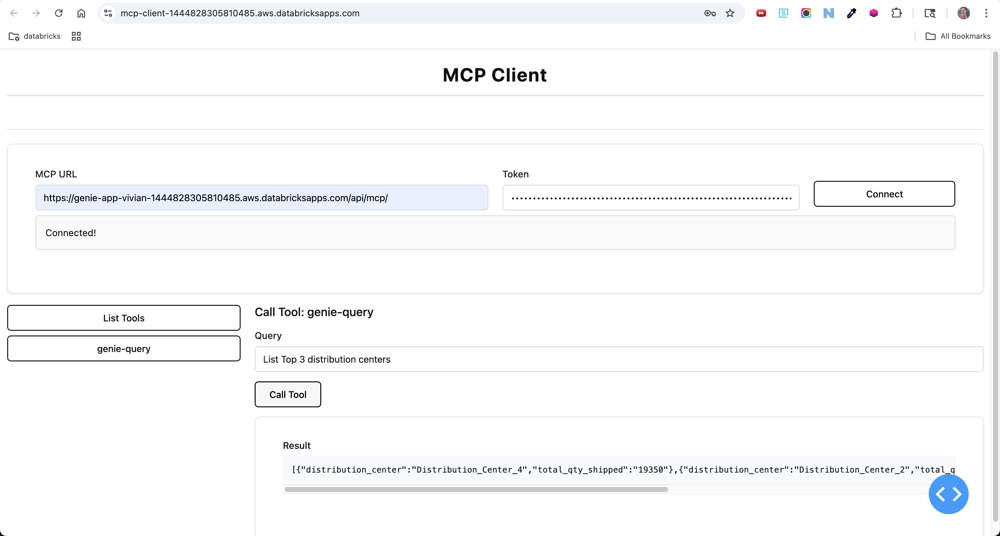

# MCP Client



This project provides both a command-line and a web-based Dash client for interacting with an MCP tools, leveraging Databricks authentication and the `fastmcp` library. It allows users to list and call available tools from the MCP tools, either programmatically or through a user-friendly web interface.

## Features

- **Command-line client** (`mcp_client.py`):  
  - Authenticates with Databricks.
  - Lists available tools from the MCP tools.
  - Calls a specified tool and prints the result.

- **Dash web client** (`mcp_dash_client.py`):  
  - Modern, responsive UI built with Dash and Bootstrap.
  - Connect to an MCP server endpoint with a Databricks token.
  - List available tools and dynamically render input forms for tool arguments.
  - View results interactively.

Install dependencies with:

```bash
pip install -r requirements.txt
```

## Usage

### Command-Line Client

Edit `mcp_client.py` to set the correct MCP server URL.

Run:

```bash
python mcp_client.py
```

This will:
- Authenticate using your Databricks credentials.
- List available tools.
- Call the `genie-query` tool with a sample query.

### Dash Web Client

## Deploying to Databricks Apps

You can deploy the MCP Client Dash app as a Databricks app by following these steps:

1. **Clone the Repository to Your Workspace**

   In your Databricks workspace, navigate to the directory where you want to deploy the app (e.g., `/Workspace/Users/your.email@databricks.com/mcp_client`). Then, clone the repository:

   ```bash
   git clone https://github.com/your-org/mcp_client.git
   ```

2. **Create and Deploy the App in Databricks**

   - Go to the Databricks Apps interface.
   - Create a new app and specify the path to the directory where you cloned the repository.
   - Complete the app creation and deployment process.

   ```databricks apps deploy mcp-client --source-code-path /Workspace/Users/your.email@databricks.com/mcp_client```

3. **Access the Dash App**

   Once deployed, your MCP Client Dash app will be running and accessible via the configured port and endpoint. You can now interact with the MCP server through the web interface provided by the app, or use the command-line client as needed.
   Please note that in order to access the MCP server url deployed on Databricks apps, the url must look like 
   ```https://app_url.aws.databricksapps.com/api/mcp/```  with "/" added at the end
